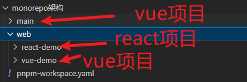

# 先了解下pnpm

使用 npm 时，依赖每次被不同的项目使用，都会重复安装一次。  而在使用 pnpm 时，依赖会被存储在内容可寻址的存储中，所以：

如果你用到了某依赖项的不同版本，只会将不同版本间有差异的文件添加到仓库。 例如，如果某个包有100个文件，而它的新版本只改变了其中1个文件。那么 pnpm update 时只会向存储中心额外添加1个新文件，而不会因为仅仅一个文件的改变复制整新版本包的内容。

所有文件都会存储在硬盘上的某一位置。它会有一个大仓库，大仓库包含了所有依赖项，
当软件包被被安装时，包里的文件会硬链接到这一位置，而不会占用额外的磁盘空间。 这允许你跨项目地共享同一版本的依赖。
因此，您在磁盘上节省了大量空间，这与项目和依赖项的数量成正比，并且安装速度要快得多！


使用pnpm store path 查看pnpm仓库路径


# pnpm的优点
- 节省磁盘空间
- 提高安装速度

# mklink 命令无法使用
报了这个错误： 无法将“mklink”项识别为 cmdlet、函数、脚本文件或可运行程序的名称。请检查名称的拼写，如果包括路径，请确保路径正确，然后再试一次。

解决办法：需要打开管理员权限的cmd，才可以使用mklink命令;

或者敲入命令：cmd 回车


# 什么是硬连接
- 硬连接指的是，一个文件与另外一个文件关联起来，他们共用通一个内存地址， 关联起来的这两个文件其中一个文件内容变化了，另一个文件也会发生改变；

- 创建硬链接： mklink /H ying.js  index.js 

# 什么是软连接
- 软链接是指创建这个文件的引用地址，软链接文件本身包含了一个指向实际文件路径的信息；就类似于创建这个文件的快捷方式，

- 创建软连接：mklink  ying.js  index.js 


# pnpm import 的作用
视频12:26

# 什么是nonorepo架构
nonorepo架构将共同的包放在同一个地方，进行集中式管理。

# 开始架构
1. 创建一下目录


2. 新建一个pnpm-workspace.yaml文件
    - pnpm-workspace.yaml 定义了工作空间的根目录，并能够使您从工作空间中包含 / 排除目录 。 默认情况下，包含所有子目录。
``` yaml
packages:
  # all packages in direct subdirs of packages/ (包的直接子目录中的所有包)
  - 'main/*'
  # all packages in subdirs of components/(组件子目录中的所有包)
  - 'web/**'
 
  ```
    - 执行pnpm i将会安装main和web目录下的依赖;
    - 最外层的node_modules将存放所有项目的公共依赖库，而项目下只会存放和自己有关系的依赖；


# 创建主应用 main
npm init vue


# 跑指定的某个项目
 pnpm -F 项目名 脚本指令。 如：pnpm -F react-demo dev 

# 公共子模块复用（公共库提取到common下）
 - 新建一个common目录，里面存放公共的组件，如：axios等； 
 - 切换到common目录，执行pnpm init
 - 打开pnpm-workspace.yaml，添加common目录，添加之后就可以用ppnpm i 安装了
 - pnpm i axios
 - 安装完之后在common目录下新建一个index.ts文件，导出axios之后，其它项目都可以引入使用了；而且你的common目录下的axios依赖变了其它引用到的项目，也会跟着变；
 ``` javascript 
  import axios from 'axios'
  export const a =  axios.get('xxx')
 ```
# 使用公共模块
- 切换到main目录

- 如果我要给main项目添加这个common模块，执行：pnpm -F main add common；
（注意我们的common目录是workspace下的，要加--workspace， pnpm -F main add common --workspace）

- 其它项目要引用这个common模块，执行：pnpm -F 项目名称 add common --workspace即可；

- 去main目录下package.json文件，dependencies就会有common这个依赖；（dependencies是项目依赖的集合，这里显示的都可以直接引入使用）
- 去main项目的main.ts 文件，引import {a} from 'common'就可以使用了；
