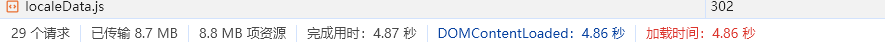
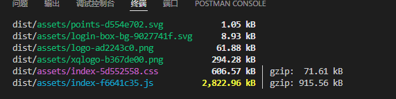
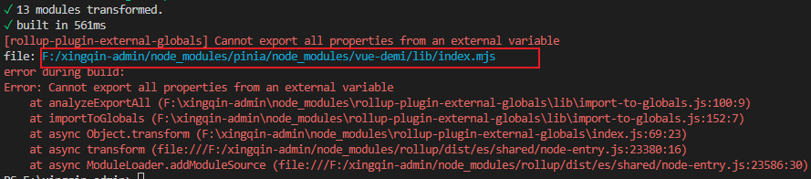
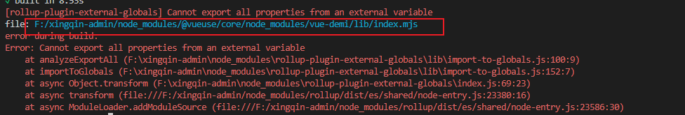
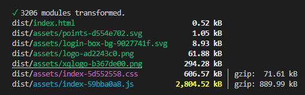
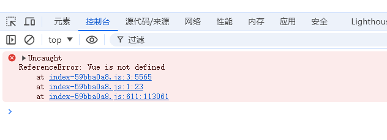
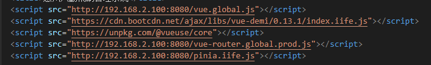
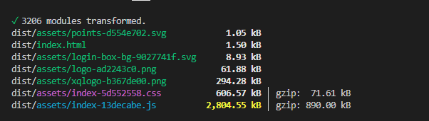

 import { visualizer } from 'rollup-plugin-visualizer'
 
  plugins: [
    vue(),
    visualizer({open: true})
  ],

  即可看出各模块的占用情况


## 启用打包优化之后的体积大小


### 没有启用打包优化之前  



## 开始启用打包优化
1. 忽略要打包的问题
```js
build: {
    rollupOptions: {
      external: ['vue'],
    },
  },
```
打包完，运行打包的index.html文件会出现以下错误：
Uncaught TypeError: Failed to resolve module specifier "vue". Relative references must start with either "/", "./", or "../".

### 有的模块使用到了vue，但是这些模块没有加入打包，而这些模块都是通ES方式引入的vue， vue不在了，这些模块自然也会报错；

# 配合rollup-plugin-external-globals排查问题;
##  rollup-plugin-external-globals 是 Rollup 插件，主要用于将外部依赖库（即不是通过 npm 安装的库）的全局变量绑定到模块的导出上。
 具体来说，例如：我们在 Rollup 中使用了一个库 jQuery，但它并没有通过 npm 安装，而是通过 script 标签引入的全局变量 $。当 Rollup 尝试将代码打包时，它并不知道 $ 变量来自哪里，因此它会默认将 $ 当成一个未定义的变量而抛出错误。

而使用 rollup-plugin-external-globals 插件，则能够告诉 Rollup，将 $ 变量绑定到模块的导出上，避免抛出错误。


1. 将这些模块一起加入到打包行列中；
```js
build: {
    rollupOptions: {
      external: ['vue'],
      plugins: [
        externalGlobals({  // 忽略一个就定义一个变量
          vue: "Vue"
        }),
      ]
    },
  },
```
2. 再打包一下
又报错了，注意红框那行就好
，
因为这个pinia它使用到了vue，但是现在vue被排除了，所以它也报错了；

3. 把再将pinia也加入到排除行列中；
```js
build: {
    rollupOptions: {
      external: ['vue', 'pinia'],
      plugins: [
        externalGlobals({  // 忽略一个就定义一个变量
          vue: "Vue",
          pinia: "Pinia"
        }),
      ]
    },
  },
```
4. 再打包，任然报错，但是这次报错是另一个文件报错了

是vueuse这个插件报的错；
接下来把它也加入到排除行列中；
```js
build: {
    rollupOptions: {
      external: ['vue', 'pinia', '@vueuse/core'],
      plugins: [
        externalGlobals({  // 忽略一个就定义一个变量
          vue: "Vue",
          pinia: "Pinia",
          '@vueuse/core': 'VueUse',
        }),
      ]
    },
  },
```
5. 再次打包，成功了;


这次浏览器报的是 Vue is not defined 这个错误，出现这个错误就好解决了；


# 接下来就是要配置cdn地址； 
只需要在index.html 文件中配置，在script标签中引入cdn地址即可；

有些cdn地址网络不稳定， 我把它改成本地做测试；

开始打包

打包成功，文件比之前小了18kb；

