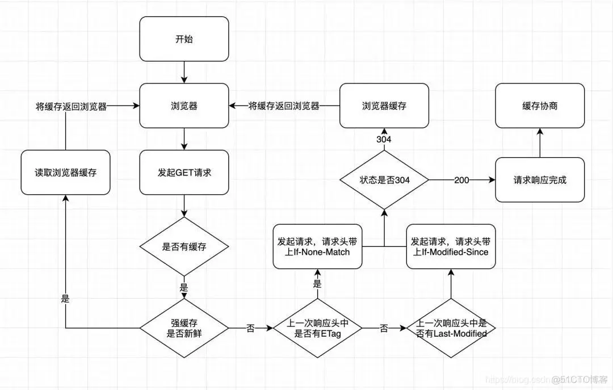

# 强缓存

强缓存时利用Expires或者Cache-Control这两个http header实现的，都是用来表示资源在客户端缓存的有效期；

## Expires缓存过程：

1、浏览器第一次跟服务器请求一个资源，服务器在返回这个资源的同时，在response的header加上Expires；

2、浏览器在接收到这个资源后，会把这个资源连同所有的response header一起缓存下来，所以缓存命中的请求返回的header并不是来自服务器，而是来自之前缓存的header；

3、浏览器再请求这个资源时，先从缓存中寻找，找到这个资源后，拿出Expires跟当前的请求时间比较，如果请求时间在Expires指定的时间之前，就能命中缓存，否则就不行；

4、如果缓存没有命中，浏览器直接从服务器加载资源时，Expires Header在重新加载的时候会被更新；

<!--  -->

## 缺点

Expires是服务器返回的一个绝对时间，在服务器时间与客户端时间相差较大时，缓存管理容易出现问题，比如随意修改下客户端时间，就能影响缓存命中的结果;
注意：expires 的优先级是最低的；

## 使用Cache-Control

在http1.1的时候，提出了一个新的header，也就是Cache-Control，这是一个相对时间，在进行缓存命中的时候，都是利用客户端时间进行判断，因此更有效安全一些，在配置缓存的时候，以秒为单位，用数值表示：如：Cache-Control：max-age=315360000;

## Cache-Control缓存过程：

1、浏览器第一次跟服务器请求一个资源，服务器在返回这个资源的同时，在response的header加上Cache-Control的header；

2、浏览器在接收到这个资源的时候，会把这个资源连同所有response header一起缓存下来；

3、浏览器再次请求这个资源的时候，先从缓存中寻找，找到这个资源之后，再拿这个过期时间跟当前的请求时间比较，如果请求时间在过期时间之前，就能命中缓存，否则就不行；

4、如果缓存没有命中，浏览器直接从服务器加载资源时，Cache-Control在重新加载的时候会被更新；

注意：cache-control优先级最高，所有的缓存机制看到 cache-control 都要服从它；在请求头和响应头中都可以设置；cache-control有多种设置，设置如下：

cache-control    描述
no-store   请求和响应都不缓存（禁用）
no-cache   协商缓存，相当于cache-control:max-age=0（每次取之前先跟服务器沟通比较）
max-age    指定缓存内容将在xxx秒后失效
public    所有内容都将被缓存（客户端和代理服务器都可缓存）
private    所有内容只有客户端可以缓存，Cache-Control的默认取值

**注意：强缓存响应头的的Date值由于是取之前缓存的值，所以即使刷新页面后这个值也不会变化**

# 协商缓存

在浏览器的强缓存失效的时候，或者请求头中设置了no-cache, 并且在请求头中设置了If-Modified-Since或者if-None-Match，那么浏览器就会发起一个请求，请求头中会带上If-Modified-Since，服务器收到请求后，会跟客户端进行比较，如果客户端的请求时间大于服务器的资源修改时间，那么服务器就会返回304状态码， 浏览器就会从缓存中获取资源， 并且响应头会设置last-modified,或者Etag属性；

## 简述： 客户端第一次向服务端发起请求，如果没有缓存，服务端正常响应，返回的响应头携带两个参数，分别是 ETag: 文件的hash码，和 Last-Modified: 文件的修改时间；

    1. 客户端再次向服务端发起请求
    2. 上面两个参数会被当作请求头携带到服务端
    3. 服务端通过两个参数确认，资源没有变化，返回304
    4. 客户端接受到304, 命中缓存，从缓存中获取资源
    5. 如果服务端资源有变化，返回200，返回最新的资源，响应头中会设置新的ETag和Last-Modified；

## Etag/if-none-match

Etag/if-none-match的值是一串hash码，代表的是一个资源的标识符，当服务器文件变化时，这个文件的hash也会随之变化，通过请求头的if-none-match和当前文件的hash比较，如果一致，说明文件没有变化，返回304，表示命中缓存；否则，说明文件有变化，返回最新的文件资源；

## last-modified/if-modified-since

这两个属性都值都是代表文件最后的修改时间，第一次请求服务器会把资源的最后修改时间放在last-modified中，第二次发起请求的时候，请求头会带上上一次响应头中的last-modified时间，并放到if-modified-since请求头中，服务器根据文件最后一次的修改时间和last-modified比较，如果一致，说明文件没有变化，返回304，表示命中缓存；否则，说明文件有变化，返回最新的文件资源；

# 为什么有会有ETag 和Last-modified?

其实最开始只有Lash-Modified，但是为什么有会有EETag呢？

1. 有些文件的修改频率可能在秒内；
2. 一个文件被重复修改，但是内容没变，我们还想让它走缓存；
3. 操作系统可能获取不到准确的修改时间，操作系统的时间是可以更改的；

ETag是last-modified的补充，通过ETag可以知道文件内容是否发生了变化;ETag的优先级会比last-modified高；

# 什么时候用强缓存，什么时候用协商缓存？

    1. 如果这个文件改动频率不大，可以用强缓存
    2.如果这个文件改动频率高，可以用协商缓存
